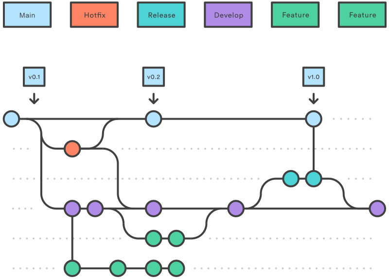

# React MUI - Dashboard
## Design
Projects, developed by the team, should use the [Atomic design](https://bradfrost.com/blog/post/atomic-web-design/).

### Components
 - All Components must be in a file that starts with a capital letter. (Fx: `BlueButton.tsx`)
 - `atoms` should be files that are purely styled components 
 - `molecules` are components that are small, but contain more than just styled components
 - `organisms` are more complex components that contain multiple molecules/atoms
### Project structure
```
├── src
│   ├── components          # Atomic design
│   |   ├── atoms           
│   |   ├── molecules       
│   |   └── organisms       
│   ├── routes              # Fx: Navigators, route definitions
│   ├── store               # Fx: Redux, etc.
│   ├── index               # A single entry file
│   └── ...                 # package declaration and config/env files.
└── README.md
```

## Git branches (workflow) - [gitflow](https://www.atlassian.com/git/tutorials/comparing-workflows/gitflow-workflow)

